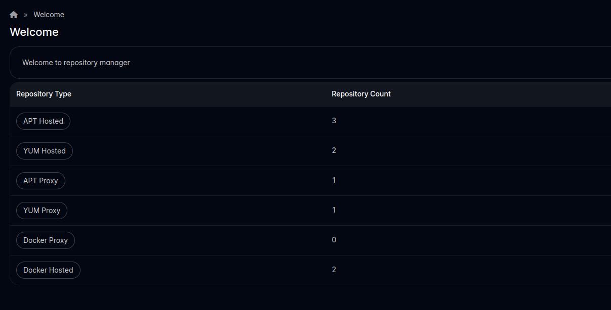
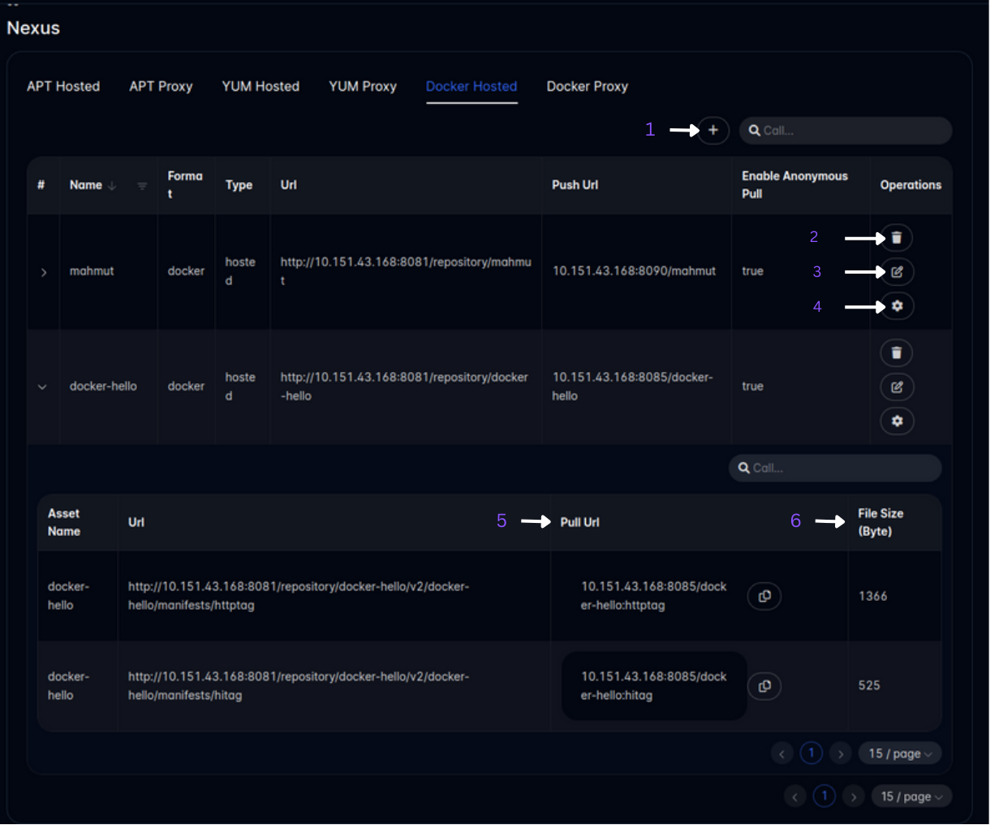
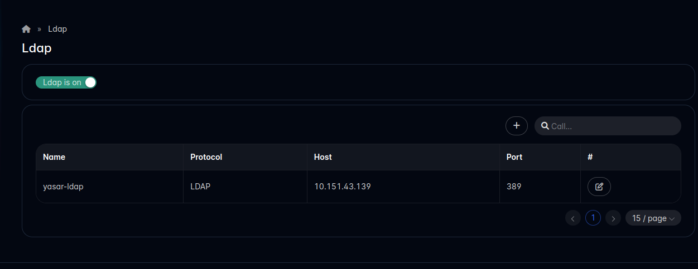
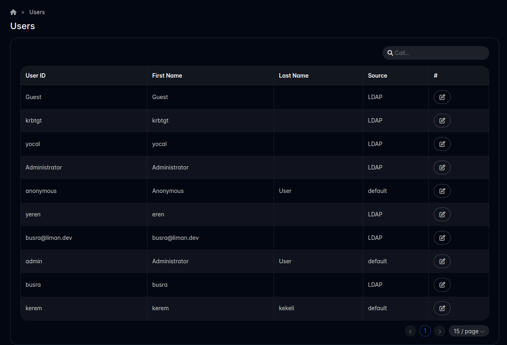

# Nexus Repository Manager

## Overview

The Nexus Repository Manager serves as a valuable Liman addon, streamlining the administration of APT, YUM, and Docker repositories within the Nexus environment. This comprehensive tool also integrates seamlessly with Ldap login, allowing users to access the Nexus system conveniently.

### Features

1. Display Repository Information
   View the number of repositories associated with each repository type.
2. Repository Management
   Effortlessly display, update, and add new repositories, spanning APT, YUM, and Docker repositories.
3. Ldap Integration
   Manage Ldap servers by displaying, editing, and adding new configurations.
4. User Permissions
   Adjust user permissions to guarantee secure and personalized access.

### Repository Manager Pages

#### Welcome Page

The Welcome page provides a snapshot of repository types and their corresponding repository counts. The intuitive repository type buttons facilitate seamless navigation within the Nexus page.

#### Nexus Page

1. Create Repository:

Clicking on the "Create Repository" button prompts the user to fill in the necessary information in the accompanying drawer (refer to the image below). Once the details are entered, the user can proceed to create a new repository.

2. Delete Repository:
   The "Delete Repository" button allows the user to remove a repository by pressing this button.
3. Update Repository:
   To modify repository details, users can utilize the "Update Repository" button.

4. View Repository Details:
   The "View Repository Details" button provides a comprehensive overview of the selected repository.

5. Copy Docker URL (Docker only):
   Users can conveniently copy the Docker URL of the asset by clicking the "Copy" button (symbolized by <i class="fa-regular fa-copy"></i>).

6. Filesize Information:
   This column displays the filesize of the asset, providing a quick reference for users.

### Ldap Page

This page enables users to check the status of the Ldap realm on Nexus and provides the functionality to open or close it. Additionally, users can perform the following actions:

1. Open/Close Ldap Realm:
   Users can determine the status of the Ldap realm and toggle between opening and closing it accordingly.

2. Add New Ldap Server:
   Users have the option to add a new Ldap server by filling in the required details.

3. View Existing Ldap Servers:
   This section displays a list of existing Ldap servers, allowing users to quickly review their configurations.

4. Edit Ldap Servers:
   Users can edit the settings of existing Ldap servers, providing flexibility in managing Ldap configurations.

5. Add/Edit Ldap Server
   In the provided image, users can visualize the form used for adding a new Ldap server or editing an existing one.

### Users Page

This page facilitates the viewing of user information and allows administrators to make changes to user permissions. Key functionalities include:

1. View User Information:
   Users can access comprehensive information about each user, providing insights into their roles and configurations within the Nexus environment.

2. Change User Permissions:
   Administrators have the ability to modify user permissions, ensuring precise control over access levels for enhanced security and tailored user experiences.
